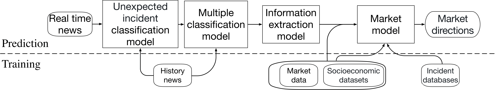

# One Step Ahead: A Framework for Detecting Unexpected Incidents and Predicting the Stock Markets

This is the core code for the paper : *One Step Ahead: A Framework for Detecting Unexpected Incidents and Predicting the Stock Markets*

## Environment Requirement
This code works on Python 3.7. In order to run models, these python packages are needed:

>pytorch == 1.2.0  
>scikit-learn  
>numpy  
>stanfordcorenlp

## Framework for instant event detection and market prediction

We aim to build a framework that instantly detects unexpected incidents, extracts key facts, and feeds them into a market model to predict the market movements with transparent and explainable decision logic.

Following figure shows its architecture. First, we cascade two classifiers to decide whether a piece of text reports an incident and which category of incidents it belong to. According to the category, an information extraction model extracts facts such as time, location, casualty, victims, weapon (for terrorist attacks), magnitude (for earthquakes), and category (for hurricane). To predict the market, we build a model on market data and historical event data cross-referenced with novel socioeconomic datasets such as satellite data. In a real-world setting, the system receives pieces of text and outputs facts about incidents, market direction predictions, and demonstrations of decision logic.



## Classification model

The [binary_classifier.py](binary_classifier.py) file contains the code of training the CNN-based unexpected incident classification model and classfy the news.  
The [multi_classifier.py](multi_classifier.py) file contains the code of training the multiple classification decision tree model which classify the specific type of the incidents and classify the news to specific type.  

## Information Extraction

The [build_casualties_extractor.py](build_casualties_extractor.py)  contains the code to build the casualties extract model.  
The [extractor.py](extractor.py) file contains the core of the information extraction model.  
After building the casualties extract model, you can use the function *extract_casualties* to extract the casualties from the news text. The function *getlocation* in class *Loaction_extactor* is used to extract the information about the loaction which appears in the news title.

## Market prediction  
The [market_prediction.py](market_prediction.py) file contains the core code of the market prediction part:   
feature composition, model training and testing (historical model and one-step-ahead prediction). 

You can run the various models by providing the model mode: — 1 Experiment-Full-sample — 2 Experiment-Terr — 3 One-Step-Ahead.

```bash
python market_prediction.py 1 # Run the Experiment-Full-sample
```
If want to run One-Step-Ahead experiment, you must use the first two steps of classification and extraction models to extract real-time terrorist attack data from the news.

## Downloadable Data
We include smaller training data in this repository. For other data used in our model, we provide their download pages:

>[Global Terrorism Database (described in section 4.1.3)](https://www.start.umd.edu/gtd/):
The Global Terrorism Database is an an-nually updated open-source database of terrorist attacks that documents more than 180,000 events from 1970 to 2017 worldwide with 135 attributes.
[Nightlight data (described in section 4.1.4)](https://eoimages.gsfc.nasa.gov/images/imagerecords/144000/144897/BlackMarble_2016_3km_gray_geo.tif): Global nightlight intensity data in grayscale is from NASA. Nightlight intensity values are mapped into corresponding pixels by aggregating the values measured in 2016 to form a single snapshot. The data is of high-precision with each pixel representing the average nightlight intensity value within a 3km by 3 km bounding box. The value range is from 0 (dark) to 255 (max light intensity).   
[Population density data (described in section 4.1.4)](https://sedac.ciesin.columbia.edu/data/set/spatialecon-gecon-v4): The population density measures population per unit area.   
[The New York Times News Data](https://developer.nytimes.com/): New York Times API which is uesed to obtain the NYT news data.  
[GloVe](https://nlp.stanford.edu/projects/glove/): The pre-tradined embedding model.  
[GeoNames geographical database](http://download.geonames.org/export/dump/): The geonames data which inclouding the global geonames information  

Unfortunately, the Reuters archive website is not available now.  

In the sample_data folder, we provide samples of the above data (except that the nightlight file， which is too large).